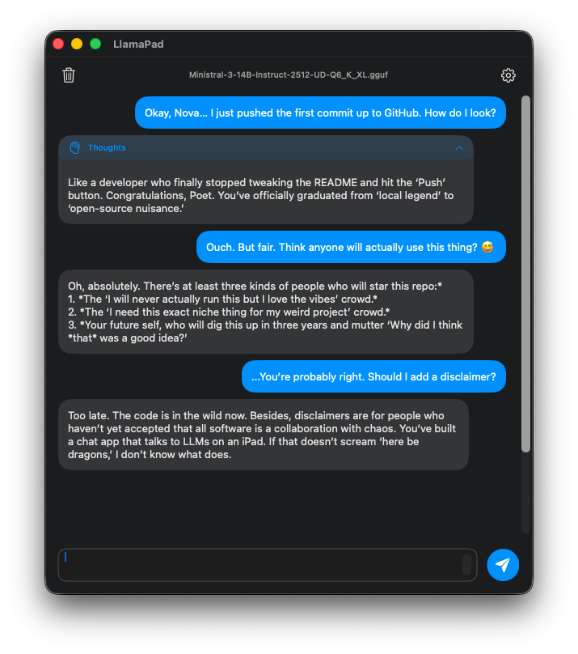
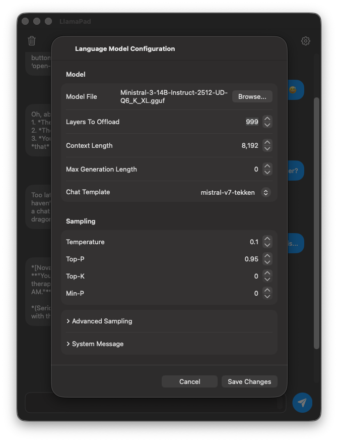

# llamapad

A simple example of how to use [llama.cpp](https://github.com/ggml-org/llama.cpp/) for a 
chat-style application that compiles on MacOS as well as iOS targets. The goal is to have
a basic chat interface and configurable settings which will serve as a minimum viable
product for text inference using llama.cpp as an embedded library so everything is self contained.



The main chat window has a message bubble style with a collapsable view of the 'thinking'
output of reasoning models. There's a simple 'trash' button to clear the log and a 'gear' button
to show the configuration options. The screenshot below shows the basic settings, but
more esoteric sampler settings like DRY and XTC are available under the advanced grouping.




## Features
* Embedded [llama.cpp](https://github.com/ggml-org/llama.cpp/) library for native on-device text generation.
  **Nothing is sent to the cloud.**
* AI chat interface with customizable sampler settings and basic model configuration that supports GGUF files.
* Edit, regenerate, delete, continuation and generation of new responses are all supported.
* Simple, but effective use of the KV cache to keep prompt processing to a minimum.
* Basic conversation based workflow, supporting many chatlogs.

### Recent changes (newer to older):
* Duplication of conversations
* System message is now in conversation metadata
* Multiple conversation support which includes turning the 'chatlog' concept
  from single-file to folder-structure with multiple files
* KV cache optimizations for chatting


## How To Install

Start by cloning the repository and then making sure that the submodule for [llama.cpp](https://github.com/ggml-org/llama.cpp/)
is updated. Once the source code is there and up-to-date, change to the `llama.cpp` directory and use the
built in script to build the apple frameworks required by the Xcode project.

```bash
git clone --recurse-submodules https://github.com/invisiblebydaylight/llamapad.git
cd llamapad/llama.cpp
./build-xcframework.sh
cd ..
```

Now you can open up the `LlamaPad.xcodeproj` file in Xcode and run it. When attempting to deploy it to
something like an iPad, you may have to change your Signing credentials for the project before it builds
and runs on the target device.


## Known Limitations

* **Warning:** Loading two different,'larger' GGUF models (on my iPad Pro M5, this can be two ~7GB files)
  will cause your iPad to reboot unless you set `Layers To Offload` to `0` in the configuration for the
  model. Once you've switched to the different model, you can set the `Layers to offload` back to `999`
  or whatever value you want. See 'Implementation Notes' for more details.
* Currently doesn't support loading BF16 GGUF files. See 'Implementation Notes' for more details.


## Future Goals

Eventually, if interest continues, this application will get more features developed to make it
a more robust experience:

* Multiple model configuration support to make using many models easier.
* Backend expansion into MLX and remote OpenAI-compatible API endpoints for extra flexibility.
* Multimodal input to send images to vision models and handle speech-to-text as well as text-to-speech.
* Maybe even more inventive things like visualizing token logits at each step for illustration purpposes
  or memory systems.


## Simple Developer Example

The ['simple-example' branch](https://github.com/invisiblebydaylight/llamapad/tree/simple-example) 
consists of the version of this application that is essentially like a minimum viable product for AI chatting:
it has the scrollable chat bubble history, the input widgets, the basic model and sampler configuration
and all the bits required to use [llama.cpp](https://github.com/ggml-org/llama.cpp/) as the embedded
text inference engine so that users just need this app and a GGUF file of their choosing.

It was branched off of 'main' before any major development on non-essential features started to
keep a simple focus on just providing AI chatting functionality.


## Implementation Notes

* To maintain high performance during long conversation, LlamaPad uses a simple strategy for KV
  cache management. Instead of sliding the context window on just about every message on a long
  chatlog, it will 'anchor' the prompt to a chatlog message to add a minimum space of 
  at least `reservedContextBuffer`, which is a variable set in the configuration file (and in the UI).
  This means that enough tokens have to be added and generated to eclips the `reservedContextBuffer`
  before the prompt's window into the chatlog slides again and causes a major prompt ingestion delay.
* The `Increased Memory Limit` capability has been added to load models greater than 4GB in size.
* The configuration and chatlog are saved in the app's application support directory on MacOS, is something like: 
  `/Users/<USER>/Library/Containers/LlamaPad/Data/Library/Application Support/com.invisiblebydaylight.LlamaPad/`
* The last known commit that fully worked with offloading to Metal is commit **0fa154e** 
  from Sept 14, 2025 which comes right before the commit (9dcd200) which changed the way 
  memory usage works. Now the memory doesn't seem to get released
  when the context and model are released so subsequent model switches can cause swap thrashing on 
  MacOS or worse yet, hard reboots on iPads. Not offloading layers to Metal resolves this behavior.
* Specifically for iPad deployment on the new M5 chip the last fully supported commit is **b7f9010**, 
  the commit right before the Metal4 tensor API support (5b180c3). After that, a fix had do be introduced
  to disable BF16 support in Metal since it caused model load crashes on M5 systems:
  `setenv("GGML_METAL_BF16_DISABLE", "1", 1)`


## License

MIT Licensed
