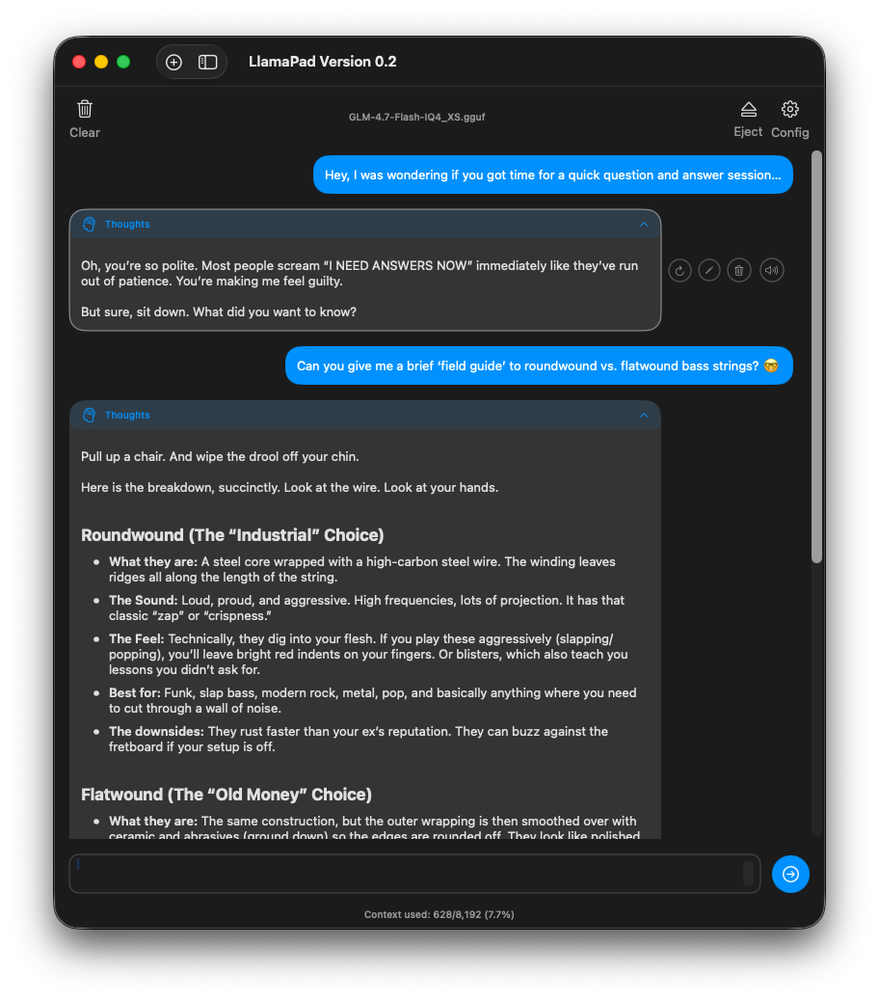
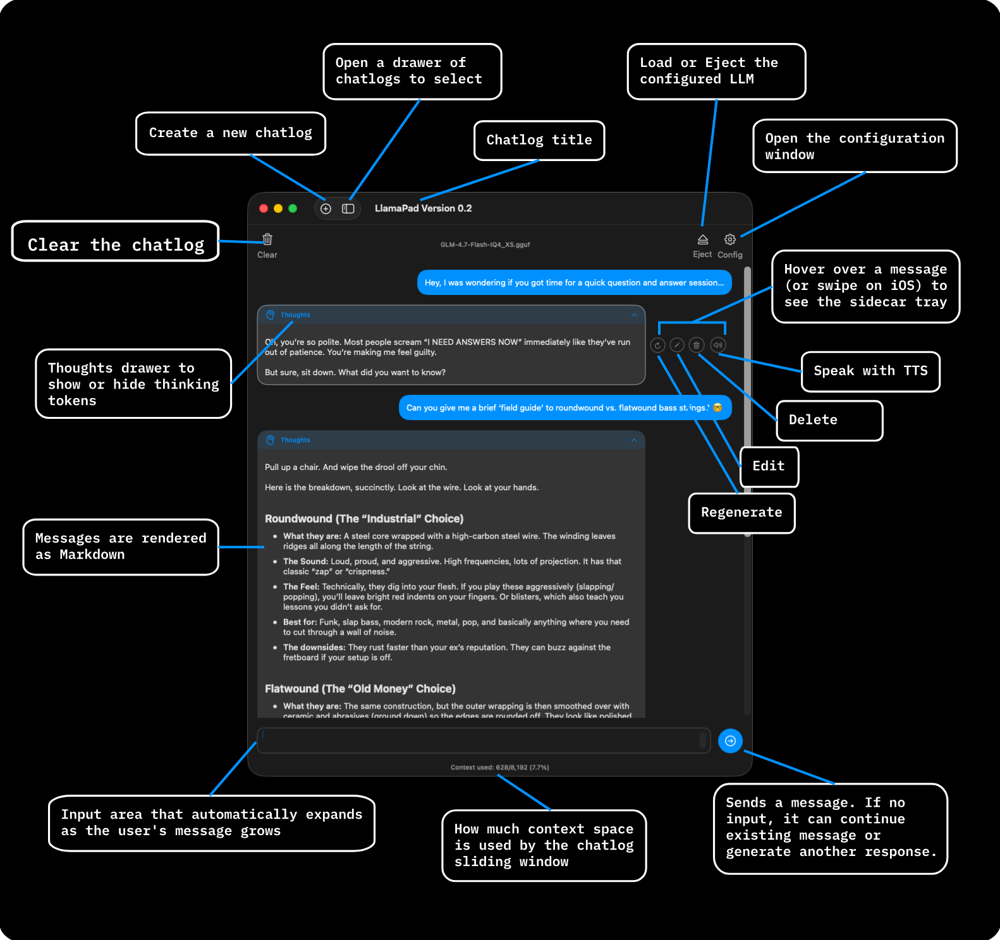
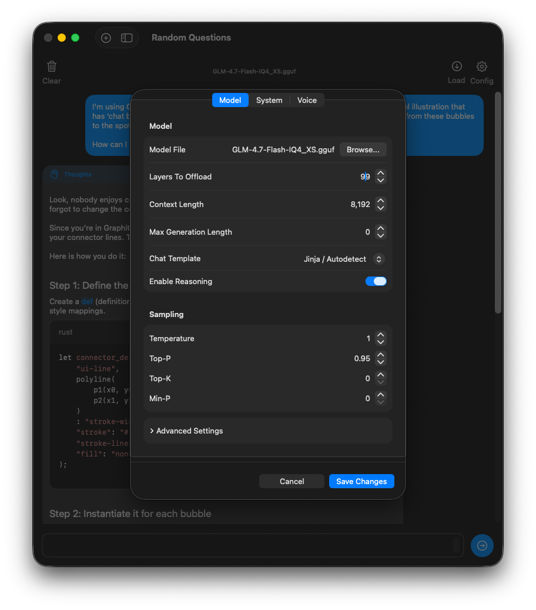
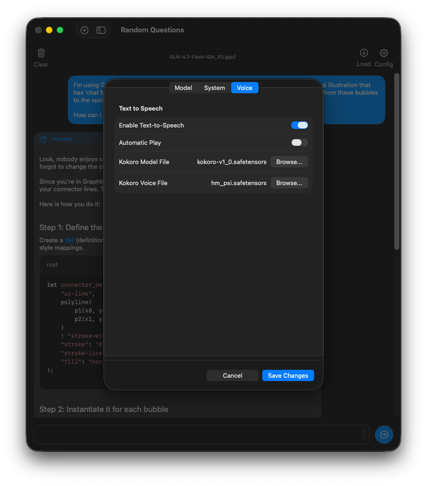

# llamapad (v0.4.0)

A native MacOS and iOS chat application for local and remote LLM inference, built on top of [llama.cpp](https://github.com/ggml-org/llama.cpp/) and [mlx-swift-lm](https://github.com/ml-explore/mlx-swift-lm). Local models run entirely on-device. The app is sandboxed with access only to the files you select. Network access is optional and only used for features you explicitly enable (Currently: Text-to-Speech setup for some models and the remote API backend). No microphone use.

Features conversation management, Jinja template support, text-to-speech
and a privacy-first design philosophy.

<a href="./screenshots/main_interface.png">
    
</a>

The main chat window has a message bubble style with a collapsable view of the 'thinking'
output of reasoning models. There's a simple 'trash' button to clear the log and a 'gear' button
to show the configuration options. 

<a href="./screenshots/interface_explained.png">
    
</a>

The options window has several tabs. The first one hold options related to the LLM model itself.
In the screenshot, you can see basic controls for the model and sampler, but when the advanced settings
expand, there are multiple penalty types as well as basic DRY and XTC support.

<a href="./screenshots/options.png">
    
</a>

The voice tab shows shows the options for text-to-speech. In order to see the 'speak' 'button next to messages
when hovering over them, you have TTS enabled. If auto-play is enabled, as soon as the AI message
finishes generating it will attempt to speak it out loud using TTS.

<a href="./screenshots/options_tts.png">
    
</a>


## Features
* Added beta support for OmniVoice TTS voice designing and cloning. The library only lets you load this model
  from HF cache, so it unfortunately must download from HF to the HF cache if it doesn't exist there already - it does
  this in the background silently.
* Embedded [llama.cpp](https://github.com/ggml-org/llama.cpp/) library for native text generation.
* Embedded [MLX](https://github.com/ml-explore/mlx-swift-lm) library for native Apple Silicon support.
* OpenAI-compatible remote API backend for connecting to cloud services (e.g. OpenRouter) or self-hosted servers (e.g. llama.cpp server, llama-swap).
* AI chat interface with customizable sampler settings and basic model configuration options.
* Text-to-speech support for AI messages, including an auto-play mode to automatically speak the generated messages.
* Edit, regenerate, delete, continuation and generation of new responses are all supported.
* Simple, but effective use of the KV cache to keep prompt processing to a minimum for GGUF models.
* Basic conversation based workflow, supporting many chatlogs.
* Jinja support for prompt formatting using the [swift-jinja](https://github.com/huggingface/swift-jinja) library.
* File and image attachements: attach text files and images to user messages via the attachment button, copy/paste or drag and drop. Text file contents are injected into the message for all backendds; currently only the remote API backend attaches images and sends them as base64-encoded content.

### Recent changes (newer to older):
* Application Settings as a new tab in the configuration window. Currently you can change the font size used for the
  chatlog in the app and you can toggle auto-scroll behavior (enabled by default).
* Smart auto-scrolling during response generation: the chatlog automatically follows incoming text,
  but disengages the moment the user scrolls up. Scrolling back down re-engages it (though that behavior might
  change in the future, depending on feedback).
* Added support for OmniVoice TTS, though it is download-only via internal HF libraries for now, depending on upstream library.
* Drag and drop support: drag text or image files onto the input bar at the bottom of the app to attach them.
* File attachements: attach text and image files to user messages; contents are injected into the prompt at the start of the message. Large file warnings prevent accidental context window exhaustion. Images are added as base64 encodes and are only currently supported by the remote API backend.
* Added support for only showing the number of messages in the chatlog as were sent to the LLM, showing just how much the AI is able to see of the conversation with current settings. Scrolling all the way to the top shows a button that can reveal all messages.
* Added cmd-uparrow and cmd-downarrow as two keyboard shortcuts that with the chatlog selected will navigate to the start and end.
* Support for remote API usage through OpenAI-compatible endpoints has been added for maximum flexibility! While it's probably obvious, note that using this backend *does* send your chatlog to whatever server you supply as an endpoint.
* Support for TTS has been changed to the [mlx-audio-swift](https://github.com/Blaizzy/mlx-audio-swift) library, which supports a number of TTS engines. This means that support for multiple engines will be enabled. Currently there is: [Kokoro](https://huggingface.co/mlx-community/Kokoro-82M-bf16), [Qwen3-TTS](https://huggingface.co/mlx-community/Qwen3-TTS-12Hz-0.6B-CustomVoice-8bit) (Base, CustomVoice and VoiceDesigner) and Chatterbox ([Chatterbox-Turbo](https://huggingface.co/mlx-community/chatterbox-turbo-fp16) seems to work better than the full version).
* Support for MLX models has landed! It might still be rough around the edges as it's a new backend. To support having a new backend implementation, a common protocol has been developed and utilized.
* Performance metrics are now recorded for each message and shown on mouse hover (macOS) or swipe (iOS).
* Added Gemma-4 thinking tag delimiter detection as well as the `[think]` and `[/think]` tags some Mistral models use.
* Lazy-loading the model is now supported. LLMs no longer load automatically on application startup. A Load/Eject
  button has been added next to the config button to manually control the behavior, otherwise the configured
  model is loaded when the user sends a message, generates a response or regenerates an existing one.
* KV cache quantization now supported and settings can be found in the 'Advanced' group of the Model config tab.
* Embedded [swift-jinja](https://github.com/huggingface/swift-jinja) to use embedded Jinja templates
  for prompt construction if possible; still can override to built-in templates from llama.cpp...
* Conversations can be created, renamed, duplicated and deleted.
* System message is now in conversation metadata.
* Multiple conversation support which includes turning the 'chatlog' concept
  from single-file to folder-structure with multiple files.
* KV cache optimizations for chatting to minimize delays from prompt ingestion.


## How To Install

Start by cloning the repository and then making sure that the submodule for [llama.cpp](https://github.com/ggml-org/llama.cpp/)
is updated. Once the source code is there and up-to-date, change to the `llama.cpp` directory and use the
built in script to build the apple frameworks required by the Xcode project.

```bash
git clone --recurse-submodules https://github.com/invisiblebydaylight/llamapad.git
cd llamapad/llama.cpp
./build-xcframework.sh
cd ..
```

Now you can open up the `LlamaPad.xcodeproj` file in Xcode and run it. When attempting to deploy it to
something like an iPad, you may have to change your Signing credentials for the project before it builds
and runs on the target device.

### Text-to-Speech Setup
#### Kokoro
Clone or download from [mlx-community/Kokoro-82M-bf16](https://huggingface.co/mlx-community/Kokoro-82M-bf16). Voice names are short identifiers like `af_heart`, `af_bella`, `am_adam`. See the [Kokoro voices list](https://huggingface.co/hexgrad/Kokoro-82M/blob/main/VOICES.md) for options. For language, use a two letter code like "en".

Kokoro requires a one-time network download of G2P support files (~5MB). Enable TTS in configuration and generate speech once with Internet access. After caching, TTS works offline.

#### Qwen3 TTS
This family of TTS models comes in different variants:

* Base: [mlx-community/Qwen3-TTS-12Hz-0.6B-Base-8bit](https://huggingface.co/mlx-community/Qwen3-TTS-12Hz-0.6B-CustomVoice-8bit) - Simple TTS with built in voice.
* Custom: [mlx-community/Qwen3-TTS-12Hz-1.7B-CustomVoice-bf16](https://huggingface.co/mlx-community/Qwen3-TTS-12Hz-1.7B-CustomVoice-bf16) - Supports named speakers (Vivian, Serena, Uncle_Fu, Dylan, Eric, Ryan, Aiden, Ono_Anna, Sohee) with style prompting.
* Voice Designer: [mlx-community/Qwen3-TTS-12Hz-1.7B-VoiceDesign-bf16](https://huggingface.co/mlx-community/Qwen3-TTS-12Hz-1.7B-VoiceDesign-bf16) - Voices are based on descriptive prompts:

| Example Prompt | Result |
|----------------|--------|
| `A cheerful young female voice with high pitch and energetic tone.` | Animated, bright delivery |
| `A calm male voice with moderate depth and a measured, thoughtful delivery.` | Grounded, intelligent sound |
| `A grounded male voice with warm resonance and a steady, unhurried pace.` | Warm, reassuring tone |

Qwen3 TTS Usage Guide:
* When using voice cloning options (Base model), make sure to have your reference audio sampled at 24kHz or else it'll sound time-warped. Supply the Reference Audio WAV file and the transcription for it in Reference Text; no need to set Voice Description.
* When using plain TTS without direction (Base model), Voice Description, Reference Audio and Reference Text do not need to be set. It'll use a 'random' voice.
* When using one of Qwen3-TTS's custom voices (CustomVoice model), set the Voice Description and reference one of the speaker names; do not set Reference Audio or Reference Text.
* When using the voice designer (VoiceDesign model), set the Voice Description but do not set Reference Audio or Reference Text.

#### OmniVoice
Only the bfloat16 and possibly the original f32 versions ot his model from `mlx-community` will work because 
they're the only complete conversions. Additionally, the library used for all of the AI audio features does not allow for this
model to be loaded from file so the app is forced to consume it from the HuggingFace ecosystem. If the model id is not 
already cached, then it will be downloaded on first use, which might take some time. 

[Editor's note: There's currently no UI for this. If you like the way this works better or otherwise have an opinion,
start a Discussion or raise an issue.] 


### Remote API Setup

Multiple profiles are supported to facilitate quick switching between providers. Configure the remote API backend in the Model tab by selecting "api" as the backend type. Then add a new **profile** by clicking the plus button on the 'Profile' picker row. Once created, the new profile needs the following things set:

* Endpoint URL: The base URL of an OpenAI-compatible API endpoint (e.g. `https://openrouter.ai/api/v1` or `http://localhost:8080/v1`).
* API Key: Bearer token for authentication. May be left blank for local servers that don't require authentication.
* Model Name: The model identifier expected by the endpoint (e.g. `google/gemma-4-31b-it`).

The remote backend uses the same context windowing strategy as local backends (anchored sliding window with runway) to maintain prompt prefix stability, which helps with server-side prompt caching and reduces re-processing costs on endpoints that support it.

Note: Plain HTTP connections to local addresses (`localhost`, `127.0.0.1`, `.local`) are supported via App Transport Security exceptions. Remote endpoints should use HTTPS.


## Known Limitations

* Using quantized KV cache instead of F16 may cause problems with flash attention on some models.
* If you want to get wild and crazy with your Mac and increase the amount of memory usable
  by Metal, you can run a command like this (which sets the limit to 20GB) to boost your upper limit:
  `sudo sysctl iogpu.wired_limit_mb=20480`
* If you're really pushing the memory limit of your device with the LLM, it's possible that
  you'll get errors when trying to use TTS and the error message will have a coreaudio exception.
  There are currently no guard rails on what size models you can load; with great power
  comes great responsibility.
* The MLX models don't support continuing partially generated messages natively unlike the llama.cpp backend.
* Token counting for the remote API backend uses a heuristic estimate (~4 characters per token) rather 
  than a real tokenizer. The context windowing logic is tolerant of this imprecision, but the token usage 
  display may be slightly inaccurate until the first response is received and actual usage data is available.
* The remote API backend does not support all sampler settings.
* Self-signed HTTPS certificates are not currently supported for remote endpoints.
  Use plain HTTP for local servers or a proper TLS certificate for remote servers.
* Attachments for messages are text-only except for the remote API backend which can handle image attachments as well.


## Future Goals

Eventually, if interest continues, this application will get more features developed to make it
a more robust experience:

* Tool call support ; MCP support for both local and remote backends.
* Paralizable, batched requests that might be useful for behind-the-scenes agent stuff.
* Multimodal input to send images to vision models and handle speech-to-text as well as text-to-speech.
* Maybe even more inventive things like visualizing token logits at each step for illustration purposes
  or memory systems.


## Simple Developer Example

The ['simple-example' branch](https://github.com/invisiblebydaylight/llamapad/tree/simple-example) 
consists of the version of this application that is essentially like a minimum viable product for AI chatting:
it has the scrollable chat bubble history, the input widgets, the basic model and sampler configuration
and all the bits required to use [llama.cpp](https://github.com/ggml-org/llama.cpp/) as the embedded
text inference engine so that users just need this app and a GGUF file of their choosing.

It was branched off of 'main' before any major development on non-essential features started to
keep a simple focus on just providing AI chatting functionality.


## Dev Dependencies
* [llama.cpp](https://github.com/ggml-org/llama.cpp/) is used as the primary AI inference engine.
* [swift-jinja](https://github.com/huggingface/swift-jinja) is used as the embedded Jinja parser.
* [MarkdownView](https://github.com/LiYanan2004/MarkdownView.git) to render chat as markdown.
* [mlx-audio-swift](https://github.com/Blaizzy/mlx-audio-swift) is used for text-to-speech synthesis.
* [mlx-swift-lm](https://github.com/ml-explore/mlx-swift-lm) for MLX language model support.


## Implementation Notes

### KV Cache & Context Anchoring
To maintain high performance, LlamaPad uses an "anchored" window strategy. 
- The `reservedContextBuffer` defines the minimum headroom kept for AI generation and thinking.
- When the context usage exceeds `contextLength - reservedContextBuffer`, the window "slides" forward.
- **The Runway Effect:** To prevent frequent, costly prompt re-ingestion, the window doesn't just slide by one message; it slides far enough to create a "runway" equal to the `contextRunway` amount. This means you will see a significant drop in context usage when the anchor moves (`reservedContextBuffer` + contextRunway), providing space for several turns of uninterrupted discourse.

### iOS and macOS
* The `Increased Memory Limit` capability has been added to load models greater than 4GB in size.
* The configuration and chatlog are saved in the app's application support directory on macOS, is something like: 
  `/Users/<USER>/Library/Containers/LlamaPad/Data/Library/Application Support/com.invisiblebydaylight.LlamaPad/`
* Metal was really obnoxious about not releasing memory no matter how long the app sleeps after freeing the model,
  context and sampler. Turns out, adding a dummy GPU operation using MLX forced a synchronization point, clearing
  the Metal command queue which caused the memory to *actually* be released.


## License

MIT Licensed
